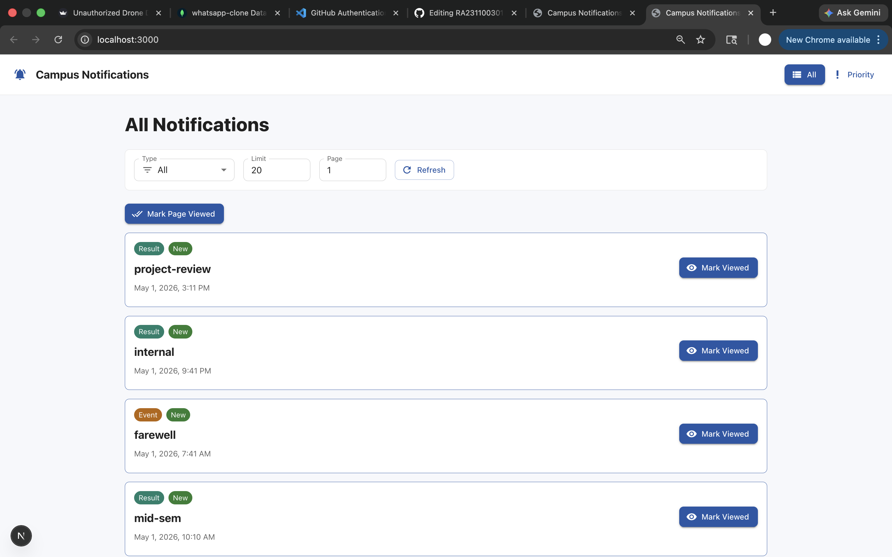
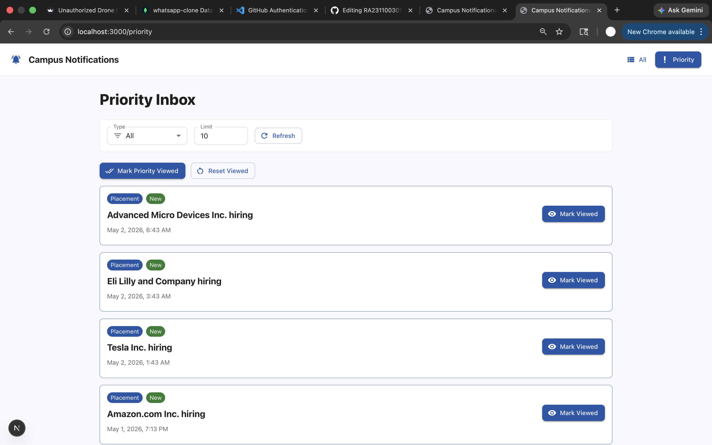
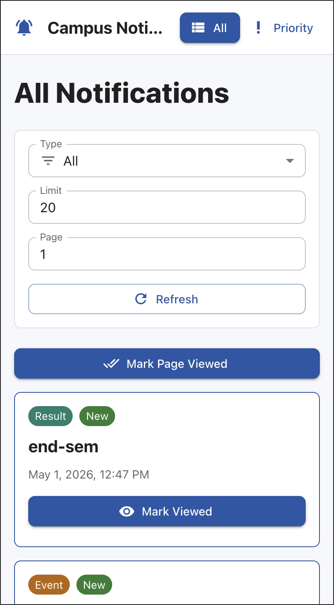
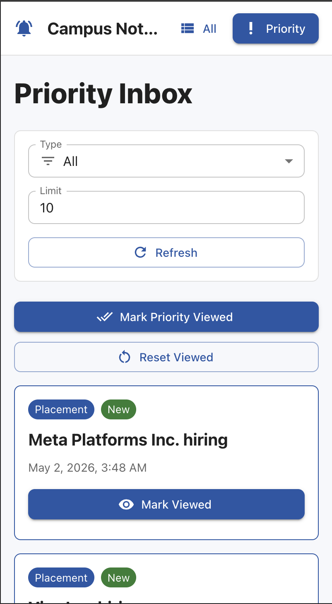

# Campus Notification Platform

A full-stack JavaScript solution for the campus notification evaluation task. The repository includes a reusable logging middleware, a Stage 1 priority-notification implementation, and a Stage 2 responsive web application built with Next.js, TypeScript, and Material UI.

## Features

- Fetches notifications from the protected evaluation API.
- Uses a reusable logging middleware for frontend and backend API events.
- Implements Stage 1 priority selection for the top unread notifications.
- Prioritizes notifications by type first, then recency:
  `Placement > Result > Event`.
- Provides a responsive Stage 2 web application at `http://localhost:3000`.
- Supports all-notification and priority-notification views.
- Supports notification type filtering, limit/page controls, refresh, viewed/new state, and error handling.
- Keeps API secrets outside Git through `.env.local`.

## Screenshots

### Desktop View

| All Notifications | Priority Inbox |
| --- | --- |
|  |  |

### Mobile View

| All Notifications | Priority Inbox |
| --- | --- |
|  |  |

## Project Structure

```text
logging_middleware/
notification_app_be/
notification_app_fe/
screenshots/
Notification_System_Design.md
```

## Environment Setup

Create the environment files from the examples:

```bash
cp .env.example .env
cp notification_app_fe/.env.example notification_app_fe/.env.local
```

Add the protected API values in `notification_app_fe/.env.local`:

```env
EVALUATION_API_BASE_URL=http://20.207.122.201/evaluation-service
EVALUATION_ACCESS_TOKEN=PASTE_ACCESS_TOKEN_HERE
```

Do not commit `.env.local`; it contains the private access token.

## Commands

Install dependencies:

```bash
npm install
```

Run tests:

```bash
npm test
```

Run the Stage 1 priority implementation:

```bash
npm run stage1 -- --limit 10
```

Run the Stage 2 web application:

```bash
npm run dev
```

Open the app at:

```text
http://localhost:3000
```

## Routes

- `/` - all notifications with filtering, pagination, and viewed state.
- `/priority` - top priority unread notifications.
- `/api/notifications` - server-side proxy for the protected notification API.
- `/api/log` - server-side proxy for logging middleware events.

## Validation

The implementation was checked with:

```bash
npm test
npm run build
```

The UI was verified in both desktop and mobile browser views.
